# 📋 Lab 01 – Làm quen với MongoDB

| Thông tin | Chi tiết |
|-----------|----------|
| **Sinh viên** | Huỳnh Thanh Dân |
| **MSSV** | 23520220 |
| **Môn học** | IE213.Q21 – Kỹ thuật phát triển hệ thống Web |
| **Nội dung** | Làm quen với MongoDB |
| **Trạng thái** | ✅ Hoàn thành |

---

## 🎯 Mục tiêu

- Tạo collection và chèn dữ liệu với `createCollection`, `insertMany`.
- Tạo unique index trên trường `id` với `createIndex`.
- Truy vấn theo điều kiện lồng nhau (`name.first`, `name.last`) và khoảng giá trị (`$gt`, `$lt`).
- Kiểm tra sự tồn tại của field với `$exists`.
- Cập nhật và xóa field với `updateMany`, `$set`, `$unset`.
- Thống kê dữ liệu theo nhóm với Aggregation: `$group`, `$sum`, `$avg`.

---

## 🔧 Công cụ / Môi trường sử dụng

| Công cụ | Chi tiết |
|---------|----------|
| **VS Code** | Soạn thảo và chạy MongoDB Playground |
| **MongoDB for VS Code** | Extension chạy file `.mongodb.js` |
| **MongoDB Compass** | Cơ sở dữ liệu chạy local |
| **mongosh** | MongoDB Shell |

---

## ⚙️ Cách chạy

Bài thực hành được viết dưới dạng **MongoDB Playground** (`.mongodb.js`), chạy trực tiếp trên VS Code:

1. Cài đặt extension **MongoDB for VS Code**.
2. Kết nối với cơ sở dữ liệu.
3. Mở file `Lab01.mongodb.js` và nhấn nút **Run All** (▶) ở góc phải màn hình.

---

## 🖼️ Kết quả đầu ra

### Câu 1
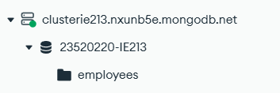

### Câu 2
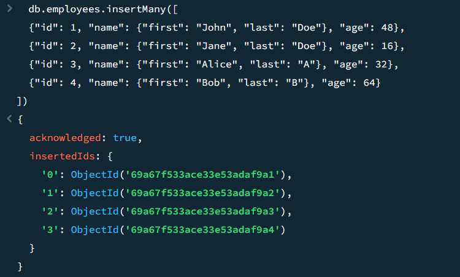

### Câu 3
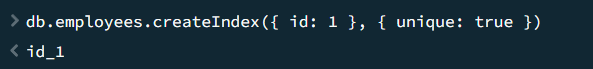

### Câu 4
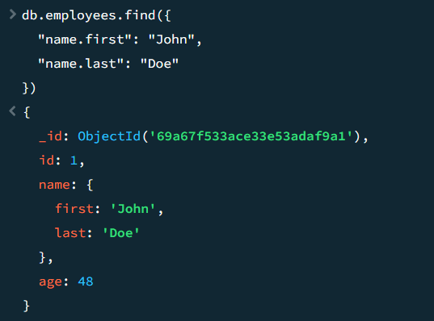

### Câu 5
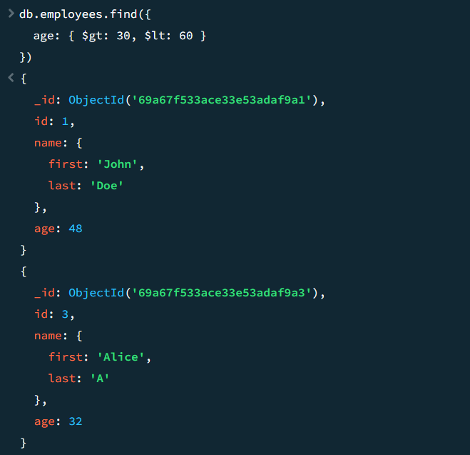

### Câu 6
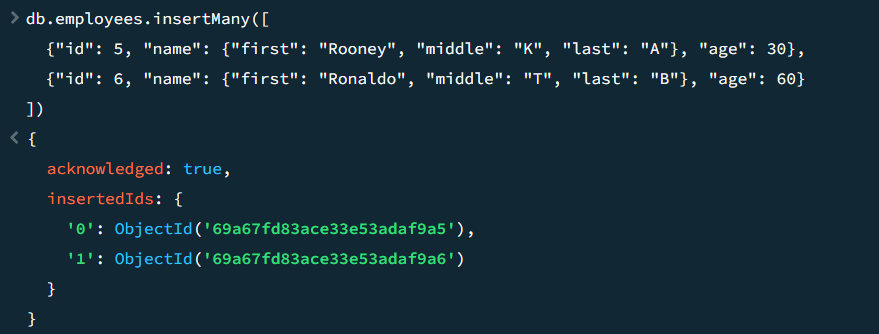
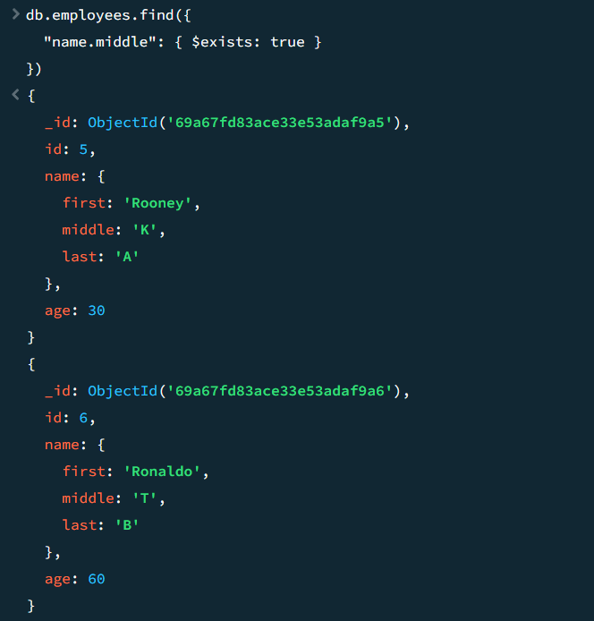

### Câu 7
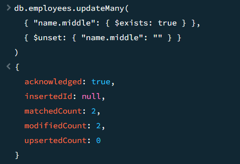

### Câu 8
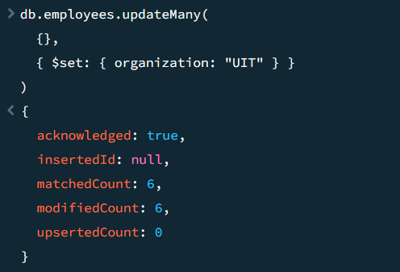

### Câu 9
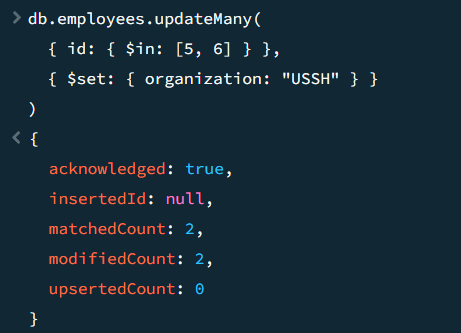

### Câu 10
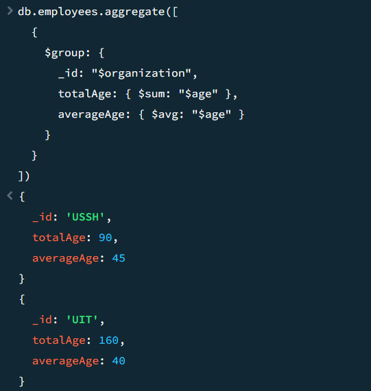

---

## 📖 Giải thích phần chính

| Câu | Nội dung |
|-----|----------|
| 2.1 | Tạo collection `employees` bằng `createCollection`. |
| 2.2 | Chèn 4 documents với trường `name` lồng nhau bằng `insertMany`. |
| 2.3 | Tạo unique index trên trường `id` để tránh trùng lặp. |
| 2.4 | Truy vấn document theo `name.first` và `name.last`. |
| 2.5 | Lọc nhân viên có `age` trong khoảng `(30, 60)` dùng `$gt`, `$lt`. |
| 2.6 | Thêm 2 document có `name.middle`, truy vấn bằng `$exists: true`. |
| 2.7 | Xóa trường `name.middle` khỏi tất cả document dùng `$unset`. |
| 2.8 | Thêm trường `organization: "UIT"` cho toàn bộ document dùng `$set`. |
| 2.9 | Cập nhật `organization: "USSH"` cho `id` 5 và 6 dùng `$in`. |
| 2.10 | Dùng `$group` để tính tổng và trung bình `age` theo từng `organization`. |