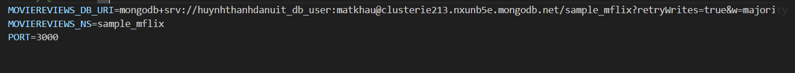
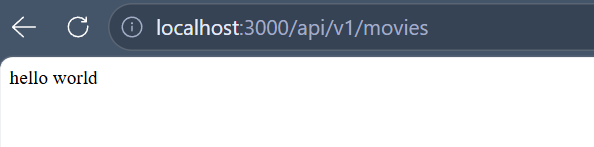
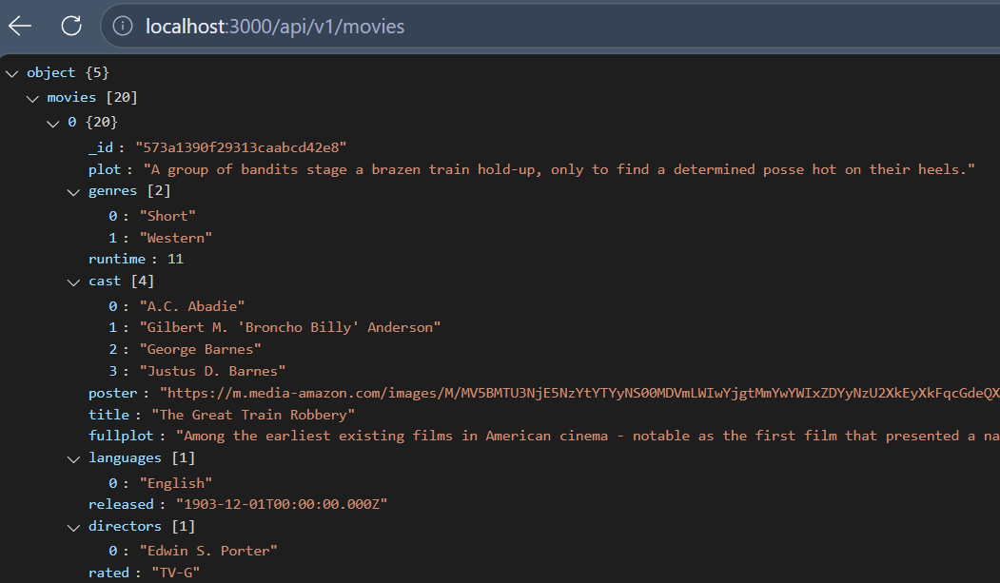

# 📋 Lab 02 – Thiết lập backend với Node và ExpressJS

| Thông tin | Chi tiết |
|-----------|----------|
| **Sinh viên** | Huỳnh Thanh Dân |
| **MSSV** | 23520220 |
| **Môn học** | IE213.Q21 – Kỹ thuật phát triển hệ thống Web |
| **Nội dung** | Thiết lập backend với Node và ExpressJS |
| **Trạng thái** | ✅ Hoàn thành |

---

## 🎯 Mục tiêu

- Thiết lập môi trường backend với Node.js và ExpressJS.
- Khởi tạo dự án với `npm init` và cài đặt các dependency: `mongodb`, `express`, `cors`, `dotenv`.
- Tạo các file cấu trúc backend: `server.js`, `index.js`, `api/movies.route.js`.
- Kết nối cơ sở dữ liệu MongoDB thông qua lớp DAO (`moviesDAO.js`).
- Xây dựng controller xử lý request (`movies.controller.js`) và bộ lọc tìm kiếm phim.

---

## 🔧 Công cụ / Môi trường sử dụng

| Công cụ | Chi tiết |
|---------|----------|
| **VS Code** | Soạn thảo và chạy code |
| **Node.js** | Môi trường chạy JavaScript phía server |
| **ExpressJS** | Framework xây dựng REST API |
| **MongoDB Compass** | Quản lý cơ sở dữ liệu chạy local |
| **nodemon** | Tự động restart server khi có thay đổi code |
| **Postman** | Kiểm thử các API endpoint |


---

## ⚙️ Cách chạy

1. Di chuyển vào thư mục backend:
```bash
cd Lab02/backend
```

2. Cài đặt các dependency:
```bash
npm install
npm install -g nodemon
```

3. Tạo file `.env` và điền thông tin kết nối MongoDB:
```
MONGODB_URI=mongodb://localhost:27017
PORT=3000
```

4. Khởi động server:
```bash
nodemon index.js
```

---

## 🖼️ Kết quả đầu ra

### Câu 1


### Câu 2


### Câu 3


### Câu 4



### Câu 5


### Câu 6


### Câu 7



---

## 📖 Giải thích phần chính

| Bài | Nội dung |
|-----|----------|
| 1 | Cài Node.js, khởi tạo project với `npm init`, cài dependency `express`, `mongodb`, `cors`, `dotenv`, `nodemon`. |
| 2 | Tạo file `server.js` — điểm khởi động server, kết nối MongoDB và lắng nghe cổng từ `.env`. |
| 3 | Tạo file `index.js` — đăng ký các route chính vào Express app. |
| 4 | Tạo `api/movies.route.js` — định nghĩa các endpoint REST cho resource movies. |
| 5 | Tạo `dao/moviesDAO.js` — lớp truy cập dữ liệu, chứa các query trực tiếp tới MongoDB. |
| 6 | Tạo `api/movies.controller.js` — xử lý logic request/response, gọi xuống DAO. |
| 7 | Cập nhật route và controller với bộ lọc tìm kiếm phim theo tiêu chí. |
