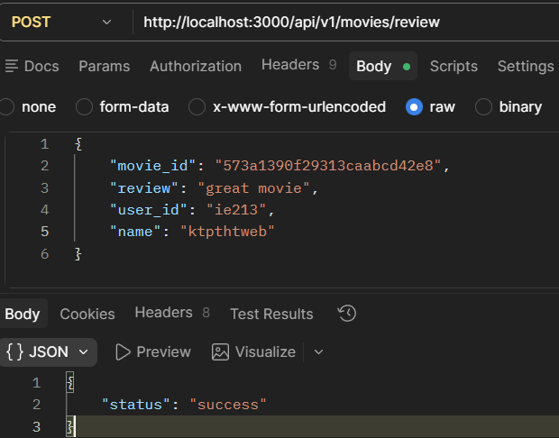
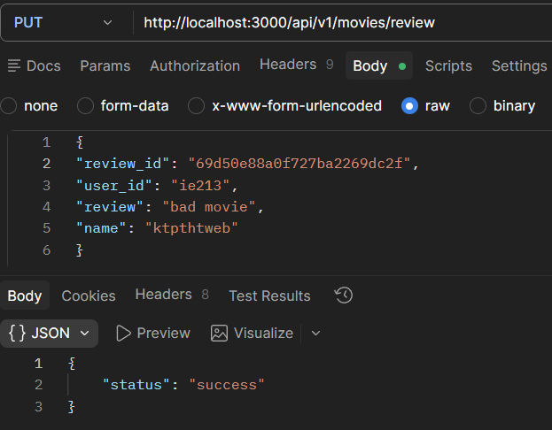
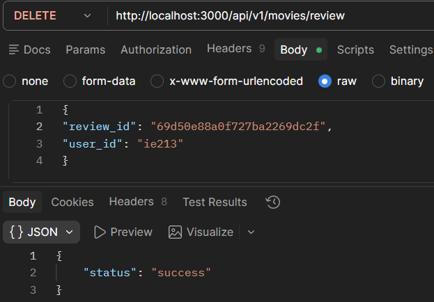
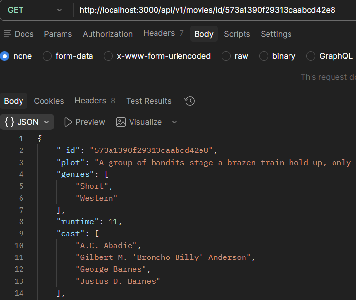
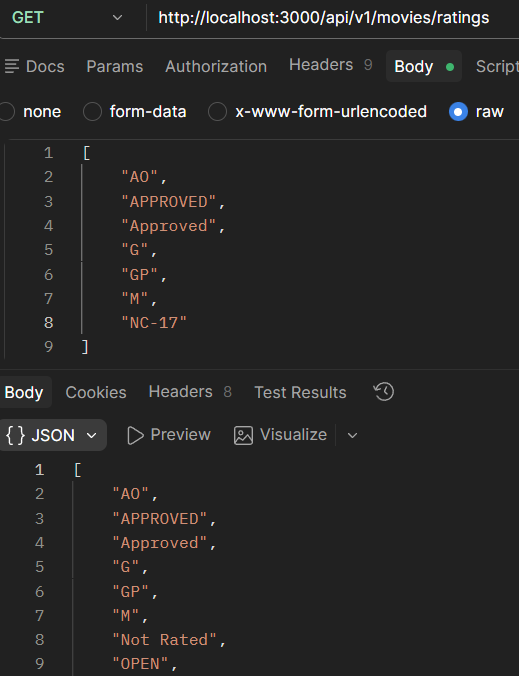

# 📋 Lab 03 – Hoàn thiện Back-end cho ứng dụng minh họa

| Thông tin | Chi tiết |
|-----------|----------|
| **Sinh viên** | Huỳnh Thanh Dân |
| **MSSV** | 23520220 |
| **Môn học** | IE213.Q21 – Kỹ thuật phát triển hệ thống Web |
| **Nội dung** | Hoàn thiện Back-end cho ứng dụng Movie Reviews |
| **Trạng thái** | Hoàn thành |

---

## 🎯 Mục tiêu

- Hiểu cách kết nối giữa Controller, Router và Data Access Object (DAO) trong xây dựng mã nguồn.
- Thực hành các phương thức HTTP: `POST`, `PUT`, `DELETE` từ máy khách lên máy chủ.
- Tạo các file `reviews.controller.js`, `reviewsDAO.js` và hoàn thiện `movies.route.js`.
- Bổ sung các chức năng lấy thông tin phim theo ID và xem đánh giá (ratings).

---

## 🔧 Công cụ / Môi trường sử dụng

| Công cụ | Chi tiết |
|---------|----------|
| **VS Code** | Soạn thảo và chạy code |
| **Node.js** | Môi trường chạy JavaScript phía server |
| **ExpressJS** | Framework xây dựng REST API |
| **MongoDB Compass** | Quản lý cơ sở dữ liệu chạy local |
| **nodemon** | Tự động restart server khi có thay đổi code |
| **Postman** | Kiểm thử các API endpoint |

---

## ⚙️ Cách chạy

1. Di chuyển vào thư mục backend:

```bash
cd Lab03/backend
```

2. Cài đặt các dependency:

```bash
npm install
npm install -g nodemon
```

3. Tạo file `.env` và điền thông tin kết nối MongoDB:

```
MOVIEREVIEWS_DB_URI=mongodb://localhost:27017
PORT=3000
```

4. Khởi động server:

```bash
nodemon index.js
```

---

## 🖼️ Kết quả đầu ra

### Bài 1 – Định tuyến cho Review (`movies.route.js`)
[movies.route.js](./movie-reviews/backend/api/movies.route.js)
<!--  -->

### Bài 2 – Reviews Controller (`reviews.controller.js`)
[reviews.controller.js](./movie-reviews/backend/api/reviews.controller.js)
<!--  -->

### Bài 3 – Reviews DAO (`reviewsDAO.js`)
[reviewsDAO.js](./movie-reviews/backend/dao/reviewsDAO.js)





### Bài 4 – Hoàn thiện back-end
[movies.route.js](./movie-reviews/backend/api/movies.route.js)

[movies.controller.js](./movie-reviews/backend/api/movies.controller.js)

[moviesDAO.js](./movie-reviews/backend/dao/moviesDAO.js)




---

## 📖 Giải thích phần chính

| Bài | Nội dung |
|-----|----------|
| 1.1 | Thêm route `/review` vào `movies.route.js` — endpoint cuối là `localhost:3000/api/v1/movies/review`. |
| 1.2 | Định tuyến `POST /review` — thêm review mới vào database. |
| 1.3 | Định tuyến `PUT /review` — cập nhật review đã có trên database. |
| 1.4 | Định tuyến `DELETE /review` — xoá review khỏi database. |
| 2.1 | Tạo `reviews.controller.js` chứa class `ReviewsController` xử lý request từ client. |
| 2.2 | Import `reviewsDAO.js` vào controller để gọi các hàm tương tác dữ liệu. |
| 2.3 | Phương thức `apiPostReview()` — xử lý request thêm review. |
| 2.4 | Phương thức `apiUpdateReview()` — xử lý request sửa review. |
| 2.5 | Phương thức `apiDeleteReview()` — xử lý request xoá review. |
| 3.1 | Tạo `reviewsDAO.js` trong thư mục `dao/`. |
| 3.2 | Phương thức `injectDB()` — kết nối tới collection reviews trên MongoDB. |
| 3.3 | Phương thức `addReview()` — thêm review vào database. |
| 3.4 | Phương thức `updateReview()` — cập nhật review trên database. |
| 3.5 | Phương thức `deleteReview()` — xoá review khỏi database. |
| 3.6 | Kiểm thử toàn bộ API review bằng Insomnia. |
| 4.1 | Thêm 2 route mới vào `movies.route.js` cho chức năng lấy phim theo ID và ratings. |
| 4.2 | Thêm `apiGetMovieById()` và `apiGetRatings()` vào `movies.controller.js`. |
| 4.3 | Thêm `getMovieById()` và `getRatings()` vào `moviesDAO.js`. |
| 4.4 | Kiểm thử API mới bằng Postman. |