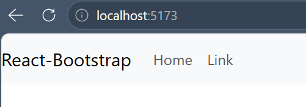
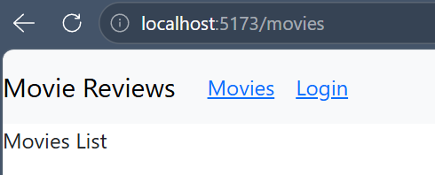
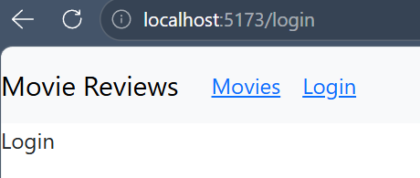

# 📋 Lab 04 – Thiết lập Frontend với ReactJS

| Thông tin | Chi tiết |
|-----------|----------|
| **Sinh viên** | Huỳnh Thanh Dân |
| **MSSV** | 23520220 |
| **Môn học** | IE213.Q21 – Kỹ thuật phát triển hệ thống Web |
| **Nội dung** | Thiết lập Frontend với ReactJS |
| **Trạng thái** | Hoàn thành |

---

## 🎯 Mục tiêu

- Hiểu cách thiết lập frontend trong MERN stack với ReactJS.
- Làm quen với một số package chủ yếu trong xây dựng mã nguồn frontend.
- Thực hành xây dựng thanh Navigation Header bar với sự hỗ trợ của Bootstrap.
- Thực hành cách chia các component trong dự án ReactJS.

---

## 🔧 Công cụ / Môi trường sử dụng

| Công cụ | Chi tiết |
|---------|----------|
| **VS Code** | Soạn thảo và chạy code |
| **Node.js** | Môi trường chạy JavaScript |
| **ReactJS** | Thư viện xây dựng giao diện người dùng |
| **Bootstrap** | Framework CSS hỗ trợ xây dựng UI |

---

## ⚙️ Cách chạy

1. Di chuyển vào thư mục frontend:

```bash
cd Lab04/frontend
```

2. Cài đặt các dependency:

```bash
npm install
```

3. Khởi động ứng dụng:

```bash
npm start
```

---

## 🖼️ Kết quả đầu ra

### Bài 1 – Thiết lập môi trường và xây dựng components
[Bài 1 movies-list.jsx](./movie-reviews/frontend/src/components/movies-list.jsx)

[Bài 1 movies-list.jsx](./movie-reviews/frontend/src/components/movies-list.jsx)

[Bài 1 add-review.jsx](./movie-reviews/frontend/src/components/add-review.jsx)

[Bài 1 add-review.jsx](./movie-reviews/frontend/src/components/add-review.jsx)

### Bài 2 – Xây dựng Navigation header bar với Bootstrap
[Bài 2 file App.jsx](./movie-reviews/frontend/src/App.jsx)



### Bài 3 – Thiết lập các định tuyến cho component
[Bài 3 file App.jsx](./movie-reviews/frontend/src/App.jsx)





---

## 📖 Giải thích phần chính

| Bài | Nội dung |
|-----|----------|
| 1 | Khởi tạo dự án ReactJS, cài đặt các package cần thiết cho frontend. |
| 2 | Xây dựng thanh Navigation Header bar sử dụng Bootstrap. |
| 3 | Tổ chức và chia các component trong dự án theo chuẩn ReactJS. |
| 4 | Thiết lập các định tuyến cho các component vừa tạo. |