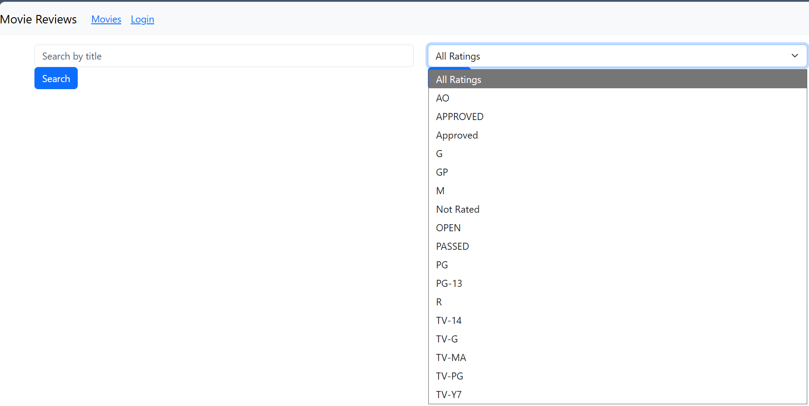
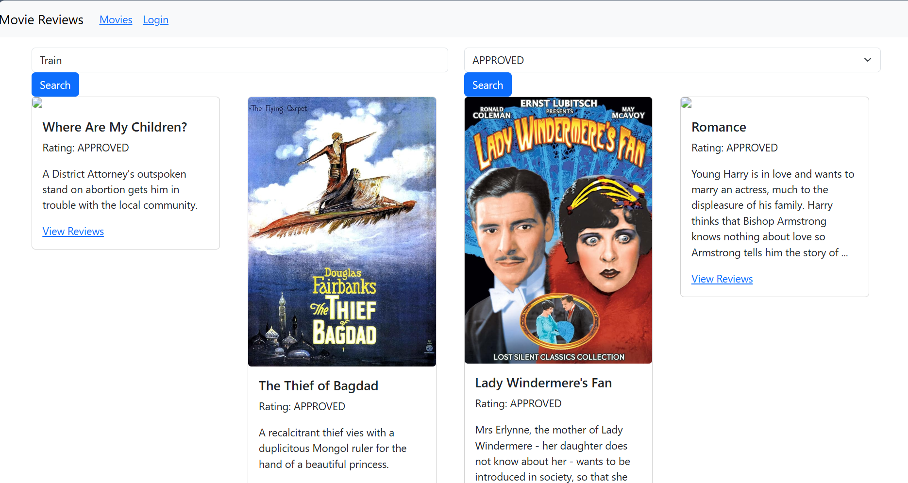
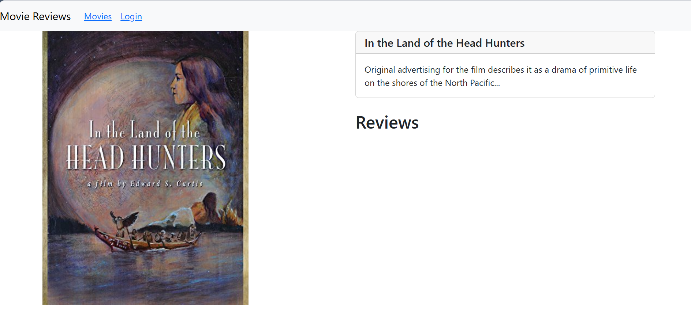
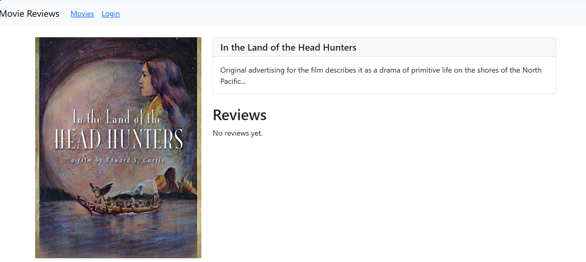

# 📋 Lab 05 – Xây dựng Frontend với ReactJS

| Thông tin | Chi tiết |
|-----------|----------|
| **Sinh viên** | Huỳnh Thanh Dân |
| **MSSV** | 23520220 |
| **Môn học** | IE213.Q21 – Kỹ thuật phát triển hệ thống Web |
| **Nội dung** | Xây dựng Frontend kết nối Backend với ReactJS |
| **Trạng thái** | Hoàn thành |

---

## 🎯 Mục tiêu

- Hiểu cách kết nối từ Frontend tới Backend với ReactJS.
- Làm quen với một số package chủ yếu trong xây dựng mã nguồn frontend.
- Tạo các form để người dùng nhập vào tìm kiếm dữ liệu.
- Hiển thị danh sách phim thông qua các component của React-Bootstrap.
- Giới thiệu các hook `useState()` và `useEffect()` trong ReactJS.
- Hiển thị trang chi tiết về Movie.
- Hiển thị các review có liên quan đến Movie.

---

## 🔧 Công cụ / Môi trường sử dụng

| Công cụ | Chi tiết |
|---------|----------|
| **VS Code** | Soạn thảo và chạy code |
| **Node.js** | Môi trường chạy JavaScript |
| **ReactJS** | Thư viện xây dựng giao diện người dùng |
| **React-Bootstrap** | Component UI |
| **React Router** | Điều hướng giữa các trang trong ứng dụng |
| **Axios** | Gửi HTTP request từ Frontend tới Backend |
| **npm** | Quản lý package |

---

## ⚙️ Cách chạy

1. Di chuyển vào thư mục frontend:

```bash
cd Lab05/frontend
```

2. Cài đặt các dependency:

```bash
npm install
```

3. Đảm bảo Backend (Lab03) đang chạy trên cổng `3000`:

```bash
cd Lab03/backend && nodemon index.js
```

4. Khởi động ứng dụng Frontend:

```bash
npm run dev
```

---

## 🖼️ Kết quả đầu ra

### Bài 1 – Kết nối Frontend tới Backend
[Bài 1 movies.js](./movie-reviews/frontend/src/services/movies.js)

### Bài 2 – Form tìm kiếm phim và Danh sách phim với Card component
[Bài 2 movies-list.jsx](./movie-reviews/frontend/src/components/movies-list.jsx)





### Bài 3 – Trang chi tiết Movie
[Bài 3 movies.jsx](./movie-reviews/frontend/src/components/movie.jsx)



### Bài 4 – Hiển thị Review của Movie
[Bài 4 movies.jsx](./movie-reviews/frontend/src/components/movie.jsx)



---

## 📖 Giải thích phần chính

| Bài | Nội dung |
|-----|----------|
| 1 | Cấu hình kết nối Frontend tới Backend qua Axios, xử lý CORS. |
| 2 | Tạo form tìm kiếm sử dụng `useState()` để lưu giá trị input và gửi request lên Backend. |
| 3 | Dùng `useEffect()` để fetch danh sách phim khi component mount, hiển thị qua `Card` của React-Bootstrap. |
| 4 | Cấu hình `Route` để điều hướng tới trang chi tiết Movie theo ID. |
| 5 | Fetch và hiển thị danh sách review liên quan đến Movie đang xem. |